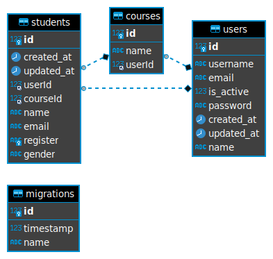

<h1 align="center">
    
</h1>

<h3 align="center">Link da API <a href="https://school-ads.herokuapp.com/" target="_blank">clicando aqui</a></h3>

---

</br>

# Sobre o projeto

**School App** é um simples projeto de CRUD para manipular dados de alunos, inspirado na interface do antigo Orkut.
</br>
</br>
"Esse projeto foi desenvolvido para a entrega final da disciplina de Web II da 2a Unidade do curso Tecnólogo em Análise e Desenvolvimento de Sistema.
<br/>

# Endpoints

- rota get `/students` Listagem dos estudantes
- rota post `/students` Cadastro de Estudante
- rota get `/students/:id` Detalhe de um estudante
- rota delete `/students/:id` Deleção de um estudante
- rota put `/students/:id` Edição de um estudante
- rota post `/courses` Cadastro de um curso
- rota get `/courses` Listagem dos cursos
- rota post `/users` Cadastro de usuário (administrador)
- rota get `/active-mail/:email` Ativação de usuário por E-mail
- rota post `/sessions` Cadastro de sessão do usuário (administrador)
- rota get `/check-session` Verificador de sessão

# Tecnologias

- [Express](https://www.npmjs.com/package/express)
- [bCryptjs](https://www.npmjs.com/package/bcryptjs)
- [Dotenv](https://www.npmjs.com/package/dotenv)
- [TypeScript](https://www.typescriptlang.org/)
- [ESLint](https://eslint.org/)
- [Jade](https://www.npmjs.com/package/pug)
- [JsonWebToken](https://www.npmjs.com/package/jsonwebtoken)
- [Mysql2](https://www.npmjs.com/package/mysql2)
- [Nodemailer](https://www.npmjs.com/package/nodemailer)
- [Typeorm](https://www.npmjs.com/package/typeorm)

---

<br/>

## Como baixar o projeto:

```bash
# Clonar o repositório
$ git clone https://github.com/jrsmarcilio/crud-school.git

# Entrar no diretório
$ cd crud-school

# Instalar as dependências
$ yarn or npm install

# Incluir as credenciais do banco
$ code src/database/index.ts

# Incluir as credenciais de configuração do e-mail
$ code .env
# MAIL_USER = SEU E-MAIL 
# MAIL_PASSWORD = SUA SENHA

# Iniciar a aplicação
$ yarn run start

# Rodar as migration
$ yarn typeorm migration:run

# Observação => Se for rodar com o npm start, lembrar de alterar a extensão do arquivo da opção entities na pasta de src/database/index.
# (entities: [__dirname + "/../entities/*.ts"])
$ yarn dev
# or
# (entities: [__dirname + "/../entities/*.js"])
$ npm start or yarn run start
```

---
